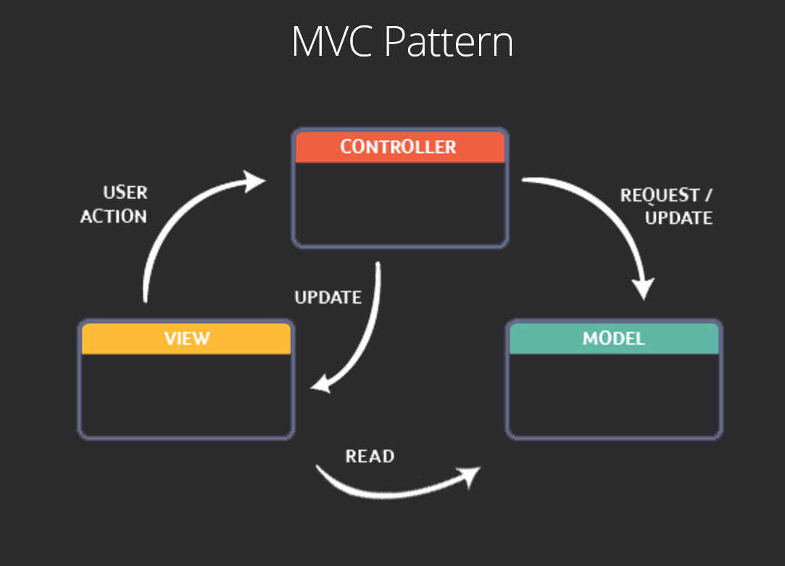

# School Java Market Project
  

## Purpose

The aim of this project is to create a entire IT infrastructure of a Markeplace. For this reason the **app** will contain a **Client side** for shopping and a **Employee side** for maintenance and analytics.

The functionalities are:
* **Client Panel:**
  + Connecion to account
  + Account creation
  + Account management
  + Shopping by searching for items
  + Payement of the shopping list
* **Employee Panel:**
  + Records of all the Clients
  + Records of all the Employees
  + Analytics of the most and least purchased products

## Method used
Technologies used in this project:
* **Java**
* **AWS database**
* **SQL** (database requests)
* **Java Fx** (for UI)
* **MVC Pattern** (Model, View Controller) design pattern

## School
This was a School project for Java and Database courses
> Grade obtained: **19,5 / 20**

## Client side
### Story board:

## Employee side
### Story board:

### Analytics overview:
In order to load faster and to not create frustrating white page transition for the user:

The loading of the differents analytics are **Threaded** (using differents CPU ressources) in order to load in parallel.

## MVC Pattern

## Diagrams (UML)
### Controller:

### Model:

### View Client:

### View Employee:

